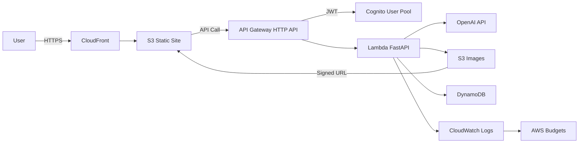

## 概要

子供向けの「お絵描き → AIリアル化」体験するシステム

## Requirements
- 予算は月 5 ドル程度
- 画像はユーザーごとに約 100 枚保存
- 保存期限はなし
- 登録制で運用（クローズドベータは招待制）
- 登録済みユーザーも回数制限を設ける
- OpenAI API の利用料金が爆発しないよう制限する
- 独自ドメインは後回しでよい

## Architecture

- フロント: S3 Static Website Hosting + CloudFront
- API: API Gateway HTTP API + Lambda (Python)
- 認証: Cognito User Pool（招待制は Admin Create User only）
- 画像保存: S3 (ユーザー別プレフィックス)
- メタ情報 / 利用制限: DynamoDB
- 監視 / 料金防衛: CloudWatch, AWS Budgets

**Architecture Diagram**

## 工夫した点

- コストと安定の拘り。静的ホスティングやDynamoDBの活用など、サーバーレスにこだわり運用コストと安定稼働の両立を実現。