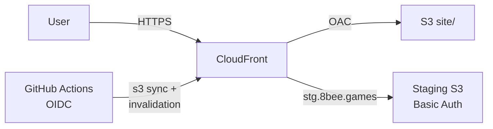

## Overview

8×8ドットのスプライトとビットマップフォントを中心とした、完全オリジナル素材レトロ風ゲームサイト。「8×8ドット(=1文字64ビット)」に「8=ハチ=蜂(bee)」を掛けたブランド名。ビルドツールなしの素の静的 HTML + ES Modules で構成し、S3 + CloudFront だけで配信する超軽量設計。

## Requirements

- 子どもを含む家族が一緒に遊べるカジュアルゲーム
- ビルド不要の静的 HTML だけで完結し、サーバーサイド処理なし
- 完全オリジナル素材（既存ゲームのキャラ・音楽の模倣なし）
- ログイン不要・個人データ不収集（localStorage のみ）
- ゲーム 1 本あたり素材 100 KB 以内の超軽量
- 月数ドル以内で稼働するホスティングコスト

## Games

| No. | タイトル | 説明 | 操作 |
|-----|----------|------|------|
| 01 | タイピング練習 | ローマ字かな入力 5 モード | キーボード |
| 02 | はなび ドーン | 花火を打ち上げるリズムゲーム | タッチ/クリック |
| 03 | Flybee（フライビー） | 蜂を飛ばす横スクロールアクション | タッチ/クリック |
| 04 | ピタッと 8 | パズルゲーム | タッチ/クリック |

## Architecture

- フロント: 静的 HTML + 素の JS (ES Modules) + Canvas 2D API
- ホスティング: AWS S3 + CloudFront（静的配信のみ）
- 音源: Web Audio API によるチップチューン生成（音源ファイルなし）
- IaC: Terraform（`infra/` で管理）
- CI/CD: GitHub Actions (OIDC) + `aws s3 sync site/`

**Architecture Diagram**

## Techniques

- **ビルドなし ES Modules 設計**。バンドラー不要で `site/` をそのまま S3 に sync するだけでデプロイ完了。ゲームは `shared/engine/` を相対 import で参照し、ゲーム間の相互参照は禁止することで自己完結性を維持。

- **仕様駆動開発**。`SPEC.md` を変更の唯一の正とし、ゲーム個別仕様は `docs/games/{game-id}.md` で管理。実装は仕様更新後に着手するルールで設計・実装の乖離を防ぐ。

- **GitHub Actions OIDC 認証**。AWS アクセスキーを Secrets に置かず、短命の AssumeRole トークンのみで S3 sync + CloudFront invalidation を実行。シークレット漏洩リスクをゼロに。

- **プライバシー重視のアクセス解析**。Cookie 不使用・匿名集計の GoatCounter を採用し、計測スクリプト本体はセルフホスト。CSP の `script-src` を自ドメインのみに絞り、サプライチェーン攻撃を遮断。

## Learnings

- 完全にビルドレスで作るゲームエンジンの設計。共通エンジン(ループ・画面・スプライト・フォント・入力・シーン管理)を ES Modules で 1 ファイル 1 責務に分割することで、ゲームごとの疎結合を実現した。

- 仕様書ファーストの開発体験。SPEC.md を正として先に仕様を固めてから実装する流れにより、Claude Code との協業時も方針がブレず、レビューの軸が明確になった。
