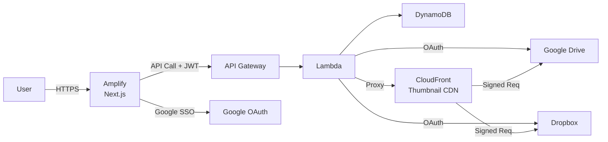

## Overview

写真データを自分では保有せず、Google Drive・Dropbox などのコネクタ経由で写真にアクセスする招待制フォトスライドショープラットフォーム。  
「写真は外部ストレージに置いたまま、スライドショーだけ共有する」がコアコンセプト。

## Requirements

- 写真を自前サーバーに保存しない（セキュリティリスク・ストレージコストの最小化）
- Google Drive / Dropbox フォルダを接続してスライドショー再生
- 招待リンクで閲覧専用アクセス・個別ダウンロード
- マルチテナント構成：複数ユーザーが独立したイベント（アルバム）を管理
- クラウド稼働コストの極小化

## Architecture

- フロント: Next.js 15 (App Router) + Tailwind CSS / AWS Amplify Hosting
- API: API Gateway + Lambda (Node.js)
- 認証: Google SSO（JWT）＋ GDrive / Dropbox OAuth
- DB: DynamoDB（ユーザー / イベント / トークン管理）
- サムネイル配信: Lambda プロキシ + CloudFront キャッシュ
- IaC: Terraform
- CI/CD: GitHub Actions (OIDC) + Amplify

**Architecture Diagram**

## Techniques

- **写真非保有ポリシーの貫徹**。サムネイルも S3 にコピーせず Lambda プロキシ経由で CloudFront にキャッシュすることで、写真を自前インフラに残さない設計を維持しながら表示パフォーマンスも確保。

- **テナント分離をパスベースで実現**。`/[username]/[event]/` のパスルーティングにより、サブドメイン方式（ワイルドカード証明書が必要）を避けて実装コストを最小化。

- **GitHub Actions OIDC 認証**。アクセスキーを管理せず短命トークンで AWS リソースにアクセスできる構成にし、シークレット漏洩リスクをゼロに。

## Learnings

- デザインを Claude Design でお試し。AI にデザインを任せる新しいワークフローを体験した。
